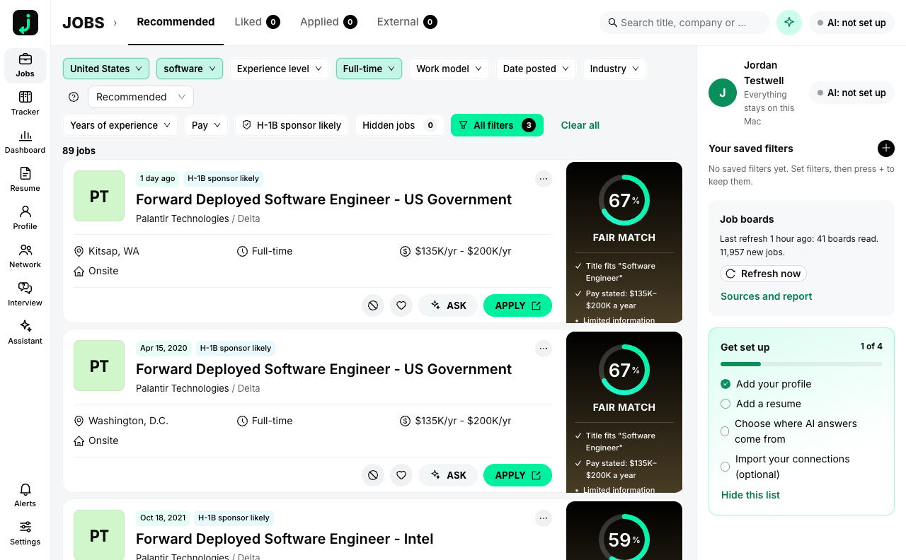

# jobleft

A job-search app that runs on your Mac. It reads employers' public job boards straight from the employer, keeps every job in a local database, ranks them against your profile, and helps you tailor a resume, track applications and reach the people you already know. Your profile, resumes, tracker, notes and connections never leave your computer. The one exception is AI, and only for the provider you pick.



## Install

1. Download `jobleft_<version>_aarch64.dmg` from the [latest release](https://github.com/Blueturboguy07/jobleft/releases/latest) (Apple silicon, macOS 14 or later).
2. Open the disk image and drag **jobleft** to Applications.
3. Open jobleft. It is signed and notarized, so there is no warning to click through.

The first run asks for your job function, job type, place, pay and work authorization, takes a resume (PDF or Word), and then reads about 40 employer boards. Jobs appear within a minute and keep arriving while you look.

## What it does

| Part | What you get |
|---|---|
| Feed | Jobs from the employers' own boards (Greenhouse, Lever, Ashby, Workable, Recruitee, Personio, Teamtailor, Gem and a few public feeds), with pay, place, work model, level, years and an "H-1B sponsor likely" hint from public filing data. Closed postings leave the feed. |
| Match | A percent and a band (Strong, Good, Fair) with three parts: experience level, skills, industry experience. Every score shows its reasons. It never changes between loads. |
| Filters | Location, job function, level, job type, work model, date posted, industry, years, pay, sponsorship. Saved filters with alerts. |
| Resumes | Import, edit, readability grade, keyword gaps, and tailoring for a job that only uses facts already in your profile. Export as PDF and Word. Cover letters the same way. |
| Tracker | Applied, Interviewing, Offer, Rejected, Archived, with notes and reminders. |
| Network | Import the `Connections.csv` that LinkedIn lets you download. See who you know at each company, who to message first and why, and a draft you send yourself. Nothing is sent by the app. |
| Assistant | Answers about your own jobs and fit. It changes nothing without your confirmation. |
| Extension | A Chrome extension that fills application forms on Greenhouse, Lever, Ashby and Workable (Workday one step at a time). It never presses Submit. |

## AI and money

Search, filters, match scores and the tracker use no AI and cost nothing. Tailoring a resume, writing a letter and the assistant run a model. You choose where:

- **publik API**: pay per use from a dollar balance, with a small free starter amount. No key to paste; jobleft keeps the connection key in the macOS Keychain.
- **A model on this computer**: Ollama, LM Studio or any OpenAI-compatible server. Nothing leaves the Mac.
- **Your own key**: Anthropic or OpenAI.

## Privacy

- Every request to an employer board carries a plain `jobleft/<version>` User-Agent and no personal data.
- One request a second per host, and `robots.txt` is honoured. LinkedIn, Indeed and Glassdoor are never contacted.
- The local service listens on `127.0.0.1` only, and only the app window and a paired extension can use it.
- No analytics, no crash reports, no update check that sends an identifier.

The data folder is `~/Library/Application Support/jobleft`. Settings → Data and backup exports or deletes all of it.

## Build from source

Node 24 and pnpm, plus Rust for the desktop shell.

```sh
pnpm install
pnpm -r test                                   # 17 suites
pnpm start                                     # builds the UI and opens the app in a browser (data in .jobleft-dev)
pnpm --filter @jobleft/shell app:build         # the desktop bundle (see apps/shell/README.md)
```

`docs/INTERFACES.md` documents the local API; `docs/BUILD-REPORT.md` says what is built and what is not.

## Licence

MIT. Third-party code and data are listed in `THIRD_PARTY_NOTICES.md`.
